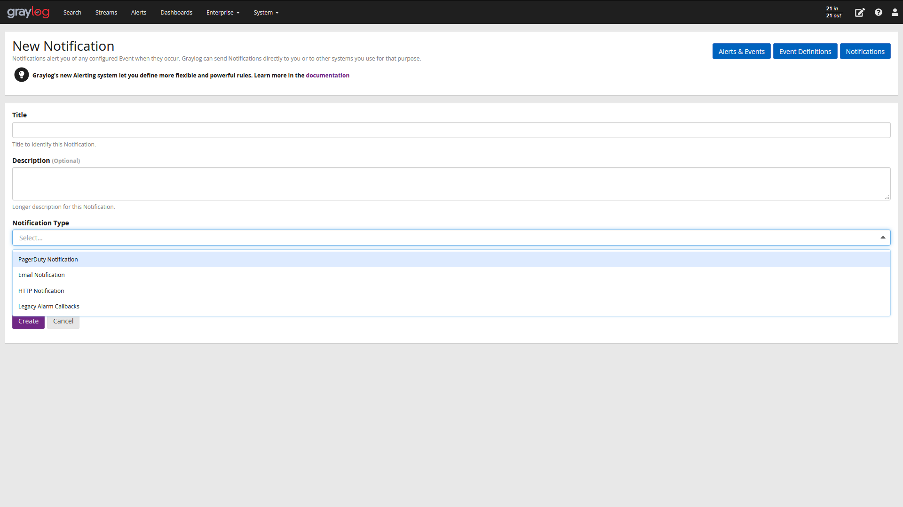

# PagerDutyNotificationPlugin Plugin for Graylog

A Notification plugin to integrate Graylog with PagerDuty as documented 
[here](https://developer.pagerduty.com/docs/events-api-v2/trigger-events/).

**Required Graylog version:** 3.3 and later

Deprecated
----------
**As of Graylog version 4.0.0, PagerDuty notifications are integrated into the core
product. Do not use the graylog-labs plugin on versions 4.x and above as it lacks 
support for new notification types.**

Installation
------------

[Download the plugin](https://github.com/graylog-labs/graylog-plugin-pagerduty/releases)
and place the `.jar` file in your Graylog plugin directory. The plugin directory
is the `plugins/` folder relative from your `graylog-server` directory by default
and can be configured in your `graylog.conf` file.

Restart `graylog-server` and you are done.

Usage
-----

After deploying the plugin, a new Notification type will be available to select in
the alerts screen. For more information about setting up an alert please 
[see](https://docs.graylog.org/en/3.1/pages/streams/alerts.html).



The following configuration parameters are required,


* _Routing Key_: The PagerDuty Routing Key defined as "[...] the 32 character 
Integration Key for an integration on a service or on a global ruleset" 
[here](https://developer.pagerduty.com/docs/events-api-v2/trigger-events/).
* _Incident Key Prefix_: The prefix to identify the event in PagerDuty.
* _Client Name_: A String to identify the integration in PagerDuty.
* _Client URL_: This will add a link to the desired destination URL that will be
included in the event. The PagerDuty event will also include a direct link to a
Graylog search query using this URL.

The following configuration parameters are optional,
* _Use Custom Incident Key_: Enabling it will generate a custom deduplication
key for correlating, the value will follow the format,
  
  ``` Incident Key Prefix/[Source Streams Separated by Comma]/Event Title ```

This is an example of a notification triggered from Graylog.


Development
-----------

You can improve your development experience for the web interface part of your plugin
dramatically by making use of hot reloading. To do this, do the following:

* `git clone https://github.com/Graylog2/graylog2-server.git`
* `cd graylog2-server/graylog2-web-interface`
* `ln -s $YOURPLUGIN plugin/`
* `npm install && npm start`

Getting started
---------------

This project is using Maven 3 and requires Java 8 or higher.

* Clone this repository.
* Run `mvn package` to build a JAR file.
* Optional: Run `mvn jdeb:jdeb` and `mvn rpm:rpm` to create a DEB and RPM package respectively.
* Copy generated JAR file in target directory to your Graylog plugin directory.
* Restart the Graylog.

Plugin Release
--------------

We are using the maven release plugin:

```
$ mvn release:prepare
[...]
$ mvn release:perform
```

This sets the version numbers, creates a tag and pushes to GitHub. Travis CI will build the release artifacts and upload to GitHub automatically.
